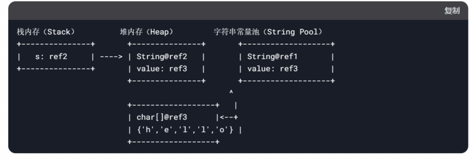

- [包装类](#包装类)
  - [包装类的分类](#包装类的分类)
- [包装类和基本数据的转换（装箱和拆箱）](#包装类和基本数据的转换装箱和拆箱)
  - [一些常用方法](#一些常用方法)
  - [面试题，底层](#面试题底层)
- [String类](#string类)
  - [介绍](#介绍)
  - [创建String对象的两种方式](#创建string对象的两种方式)
  - [底层+的优化](#底层的优化)
  - [常用方法](#常用方法)
- [StringBuffer类](#stringbuffer类)
  - [介绍](#介绍-1)
  - [String vs StringBuffer](#string-vs-stringbuffer)
  - [构造器](#构造器)
  - [常用方法](#常用方法-1)
- [StringBuilder类](#stringbuilder类)
- [Math类](#math类)
  - [常用方法](#常用方法-2)
- [Arrays类](#arrays类)
  - [常用方法](#常用方法-3)
- [System类](#system类)
- [BigDecimal类和BigInteger类](#bigdecimal类和biginteger类)
  - [常见方法](#常见方法)
- [Date类](#date类)
  - [第一代日期类](#第一代日期类)
  - [第二代日期类](#第二代日期类)
  - [第三代日期类](#第三代日期类)

## 包装类

### 包装类的分类

针对八种数据类型相应的引用类型——包装类

有了类的特点，就可以调用类中的方法

## 包装类和基本数据的转换（装箱和拆箱）

装箱：基本数据类型->包装类型，拆箱就是反过来

jdk5以前为手动装箱和拆箱，之后为自动装箱和拆箱

自动装箱底层调用的是valueOf方法，比如Interger.valueOf()

### 一些常用方法

- Interger.MIN_VALUE返回最小值
- Interger.MAX_VALUE返回最大值
- Character.isDigit()判断是不是数字
- Character.isLetter()判断是不是字母
- Character.isUpperCase()判断是不是大写
- Character.isLowerCase()判断是不是小写
- Character.isWhiteSpace()判断是不是空格
- Character.toUpperCase()转成大写
- Character.toLowerCase()转成小写

### 面试题，底层

Integer底层创建机制

-128 - 127的时候是直接返回同一个对象的引用，类似String，超出这个范围是新建一个对象

## String类

### 介绍

String对象用于保存字符串，也就是一组字符序列

字符串常量对象是用双引号括起的字符序列，比如“你好”

字符串的字符使用Unicode字符编码，一个字符（不区分字母还是汉字）占两个字节

String实现的接口
- Serializable(String 可以串行化：可以在网络传输)
- Compareable(String对象可以比较大小)

String 是final类，不能继承

String 有属性 private final char value[];用于存放字符串内容

一定要注意：value是一个final类型，不可以修改（不可以修改指针本身，可以修改指针所指向的值）

### 创建String对象的两种方式

String s = "a"（直接赋值）
- 先从常量池查看是否有a数据空间，如果有则直接指向a，如果没有则重新创建，然后指向，s最终指向的是常量池的空间地址

String s2 = new String("a")
- 先在堆中创建空间，里面维护了value属性，指向常量池的a空间，如果有，直接通过value指向，没有则重新创建然后指向。最后指向的是堆中的空间地址

### 底层+的优化

//此处为jdk8，jdk9之后优化方式不同，但逻辑上是差不多的

1. 先创建一个StringBuilder对象(sb)
2. sb.append(a)
3. sb.append(b)
4. return sb.toString

- 例题

	`String a = "hello" + "abc";`//底层会直接拼好，只有一个对象

	//如果是两个对象相加那么就是三个对象

### 常用方法

length()：返回字符串的长度

charAt(int index)：返回字符串指定索引位置的字符

substring(int beginIndex, int endIndex)：返回字符串指定索引范围的子串

toUpperCase()：将字符串转换为大写。

toLowerCase()：将字符串转换为小写

trim()：去除字符串两端的空格

replace(char oldChar, char newChar)：将字符串中所有的旧字符替换为新字符

split(String regex)：将字符串按指定的正则表达式分割成字符串数组

## StringBuffer类

### 介绍

- StringBuffer代表可变的字符序列，可以对字符串内容进行增删，很多方法和String一样，但是StringBuffer是可变长度的
- StringBuffer的直接父类是AbstractStringBuilder
- StringBuffer实现了Serializable，即StringBuffer的对象可以串行化
- 在父类中AbstractStringBuilder有属性char[] value,不是final 
- StringBuffer是一个final类，不能被继承
- 因为StringBuffer字符内容是存在char[] value,所以值是可以变化的，不用和String一样每次都更换地址（即不是每次都创建新对象）

### String vs StringBuffer

- String保存的是字符串常量，里面的值不能更改，每次String类的更新实际上是更改地址，效率较低
- StringBuffer保存的是字符串变量，里面的值可以更改，每次StringBuffer的更新实际上可以更新内容，不用每次更新地址，效率较高

### 构造器

- ():创建一个大小为16的char[],用于存放字符内容
- (int capacity)：通过构造器指定char[]大小
- (String str):给一个String创建StringBuffer,char[]大小就是str.length() + 16

### 常用方法

- 增append
- 删delete
- 改replace
- 查IndexOf
- 插insert
- 获取长度length

## StringBuilder类

- String:不可变字符序列，效率低但是复用率高
- StringBuffer:可变字符序列，效率较高（增删），线程安全
- StringBuilder:可变字符序列，效率最高，线程不安全
- StringBuffer和StringBuilder非常类似，均代表可变的字符序列，而且方法也一样
- 区别：StringBuilder是非线程安全的，效率比StringBuffer高，但是StringBuilder的对象可以被多个线程共享，而StringBuffer对象是非线程安全的，每次只能被一个线程使用

## Math类

### 常用方法
- abs(a)求绝对值
- pow(a,b)求幂(a的b次方)
- ceil(a)向上取整
- floor(a)向下取整
- round(a)四舍五入
- sqrt(a)求开方
- random()求随机数(0-1)
- max(a,b)求两个数之间的最大值
- min(a,b)求两个数的最小值

## Arrays类

### 常用方法
- toString 返回数组的字符串形式
- sort排序（可以使用自定义的排序方法）
- binarySearch通过二分搜索法进行查找，要求必须排好序（）
- copyOf数组元素的复制（可以改拷贝的长度）
- fill数组元素的填充（使用该内容填充所有元素，相当于把所有元素都换成该内容）
- equals判断数组元素内容是否完全一致
- asList将一组值，转换为list

## System类

- exit退出当前程序
- arraycopy复制数组元素，比较适合底层调用，一般使用Arrays.copyOf完成复制数组
- currentTimeMillens：返回当前时间距离1970-1-1的毫秒数
- gc:运行垃圾回收机制

## BigDecimal类和BigInteger类

简单来说，这两个类是又大又精确，可以用来做精准计算。

### 常见方法
- add加
- subtract减
- multiply乘
- divide除

## Date类

第一代第二代了解一下就好，都用第三代的
### 第一代日期类

- Date
//精确到毫秒，代表特定的瞬间
- SimpleDateFormat
//格式和解析日期的类

### 第二代日期类

Calendar（日期）类是一个抽象类，它为特定瞬间与一组诸如YEAR,MONTH,DAY_OF_MONTH,HOUR等日历字段之间的转换提供了一些方法，并为操作日历字段提供了一些方法

### 第三代日期类

- LocalDate(日期)，LocalTime(时间)，LocalDateTime(日期时间)，jdk8加入
- DateTimeFormatter格式日期类

