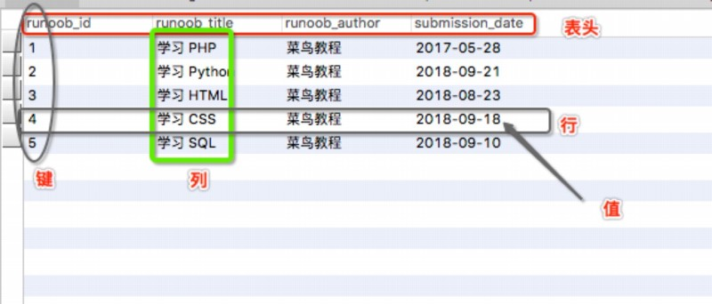
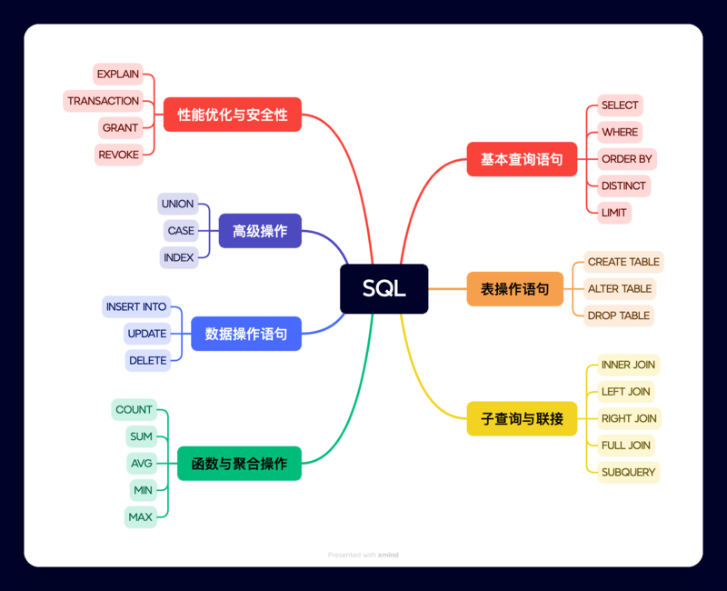
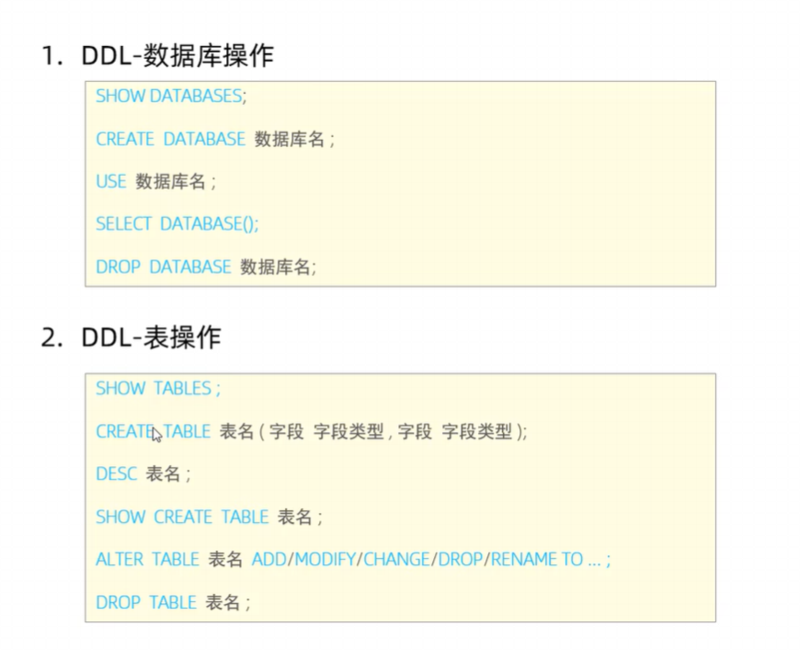

- [Mysql以及简介](#mysql以及简介)
  - [什么是数据库](#什么是数据库)
  - [RDBMS术语](#rdbms术语)
- [简单sql语句](#简单sql语句)
  - [简介](#简介)
    - [SQL通用语法](#sql通用语法)
    - [SQL分类](#sql分类)
  - [DDL](#ddl)
    - [数据表操作](#数据表操作)
      - [查询](#查询)
      - [创建表](#创建表)
      - [删除表](#删除表)
      - [修改](#修改)
    - [数据库操作](#数据库操作)
      - [创建数据库](#创建数据库)
      - [删除数据库](#删除数据库)
      - [查询](#查询-1)
      - [使用](#使用)
  - [DML](#dml)
    - [增加数据](#增加数据)
    - [修改数据](#修改数据)
    - [删除数据](#删除数据)
  - [DQL](#dql)
    - [基本语法与快速入门](#基本语法与快速入门)
    - [基本查询](#基本查询)
    - [条件查询](#条件查询)
    - [聚合函数](#聚合函数)
    - [分组查询](#分组查询)
    - [排序查询](#排序查询)
    - [分页查询](#分页查询)
  - [DCL](#dcl)
    - [管理用户](#管理用户)
      - [查询用户：](#查询用户)
      - [创建用户:](#创建用户)
      - [修改用户密码：](#修改用户密码)
      - [删除用户：](#删除用户)
      - [例子：](#例子)
      - [注意事项](#注意事项)
    - [权限控制](#权限控制)
      - [查询权限：](#查询权限)
      - [授予权限：](#授予权限)
      - [撤销权限：](#撤销权限)
      - [注意事项](#注意事项-1)
- [函数](#函数)
  - [字符串函数](#字符串函数)
    - [常用函数：](#常用函数)
    - [使用示例](#使用示例)
  - [数值函数](#数值函数)
    - [常用函数](#常用函数-1)
  - [日期函数](#日期函数)
    - [常用函数](#常用函数-2)
  - [流程函数](#流程函数)
    - [常用函数](#常用函数-3)
    - [例子：](#例子-1)
- [约束](#约束)
  - [常用约束](#常用约束)
  - [例子](#例子-2)
  - [外键约束](#外键约束)
  - [外键约束的删除，更新行为](#外键约束的删除更新行为)
- [多表查询](#多表查询)
  - [总](#总)
    - [多表关系](#多表关系)
    - [逻辑键](#逻辑键)
    - [多表查询](#多表查询-1)
  - [连接查询](#连接查询)
    - [内连接查询](#内连接查询)
    - [外连接查询](#外连接查询)
    - [自连接查询](#自连接查询)
    - [联合查询](#联合查询)
  - [子查询](#子查询)
    - [标量子查询](#标量子查询)
    - [列子查询](#列子查询)
    - [行子查询](#行子查询)
    - [表子查询](#表子查询)
- [事务](#事务)
  - [介绍](#介绍)
  - [基本操作](#基本操作)
  - [四大特性ACID](#四大特性acid)
  - [并发事务](#并发事务)


## Mysql以及简介

### 什么是数据库

数据库（Database）是按照数据结构来组织、存储和管理数据的仓库。

每个数据库都有一个或多个不同的 API 用于创建，访问，管理，搜索和复制所保存的数据。

我们也可以将数据存储在文件中，但是在文件中读写数据速度相对较慢。

所以，现在我们使用关系型数据库管理系统（RDBMS）来存储和管理大数据量。所谓的关系型数据库，是建立在关系模型基础上的数据库，借助于集合代数等数学概念和方法来处理数据库中的数据。

RDBMS 即关系数据库管理系统(Relational Database Management System)的特点：
1. 数据以表格的形式出现
2. 每行为各种记录名称
3. 每列为记录名称所对应的数据域
4. 许多的行和列组成一张表单
5. 若干的表单组成database
---
### RDBMS术语
- **数据库**: 数据库是一些关联表的集合。
- **数据表**: 表是数据的矩阵。在一个数据库中的表看起来像一个简单的电子表格。
- **列**: 一列(数据元素) 包含了相同类型的数据, 例如邮政编码的数据。
- **行**：一行（元组，或记录）是一组相关的数据，例如一条用户订阅的数据。
- **冗余**：存储两倍数据，冗余降低了性能，但提高了数据的安全性。
- **主键**：主键是唯一的。一个数据表中只能包含一个主键。你可以使用主键来查询数据。
- **外键**：外键用于关联两个表。
- **复合键**：复合键（组合键）将多个列作为一个索引键，一般用于复合索引。
- **索引**：使用索引可快速访问数据库表中的特定信息。索引是对数据库表中一列或多列的值进行排序的一种结构。类似于书籍的目录。
- **参照完整性**: 参照的完整性要求关系中不允许引用不存在的实体。与实体完整性是关系模型必须满足的完整性约束条件，目的是保证数据的一致性。

MySQL 为关系型数据库(Relational Database Management System), 这种所谓的"关系型"可以理解为"表格"的概念, 一个关系型数据库由一个或数个表格组成, 如图所示的一个表格



- 表头(header): 每一列的名称;
- 列(col): 具有相同数据类型的数据的集合;
- 行(row): 每一行用来描述某条记录的具体信息;
- 值(value): 行的具体信息, 每个值必须与该列的数据类型相同;
- 键(key): 键的值在当前列中具有唯一性。

## 简单sql语句

### 简介

#### SQL通用语法

SQL语句可以单行或多行书写，以分号结尾

SQL语句可以使用空格/缩进来增强语句的可读性

Mysql数据可的SQL语句不区分大小写，关键字最好使用大写

注释：
- 单行注释：--或#
- 多行注释：/* ... */

#### SQL分类

- DDL 数据定义语言(Data Definition Language)，用来定义数据库对象
- DML 数据操作语言(Data Manipulatuon Language)，用来对数据库中的数据进行增删改
- DQL 数据查询语言(Data Query Language)，用来查询数据库中表的记录
- DCL 数据控制语言(Data Control Language)，用来创建数据库用户，控制数据库的访问权限



### DDL



#### 数据表操作

##### 查询
---
查询当前所有数据表

`SHOW TABLES;`

查询表结构

`DESC 表名;`

查询指定表的建表语句;

` SHOW CREATE TABLE 表名;`

##### 创建表
---
语法

```SQL
CREATE TABLE table_name (
    column1 datatype [约束][COMMENT 注释],
    column2 datatype,
    ...
)[COMMENT 注释];
```

如果你希望在创建表时指定数据引擎，字符集和排序规则等，可以使用 CHARACTER SET 和 COLLATE 子句

参数说明：

table_name 是你要创建的表的名称。

column1, column2, ... 是表中的列名。

datatype 是每个列的数据类型。

##### 删除表
---

```
drop  table [ if exists ]  表名;
```


##### 修改
---

添加字段

`ALTER TABLE 表名 ADD 字段名 类型（长度）[COMMENT 注释][约束]`

修改字段名和字段类型

`ALTER TABLE 表名 CHANGE 旧字段名 新字段名 类型(长度) [COMMENT 注释][约束]`

删除字段

`ALTER TABLE 表名 DROP 字段名 [COMMENT 注释][约束]`

修改表名

`ALTER TABLE 表名 RENAME TO 新表名`

#### 数据库操作

##### 创建数据库
---

基本语法：
```sql
CREATE DATABASE [IF NOT EXISTS] database_name
  [CHARACTER SET charset_name]//指定字符集
  [COLLATE collation_name];//指定排序规则
```

##### 删除数据库
---

基本语法：
```sql
DROP DATABASE <database_name>;        -- 直接删除数据库，不检查是否存在
或
DROP DATABASE [IF EXISTS] <database_name>;
```

##### 查询
---

查询所有数据库
` SHOW DATABASE;`
查询当前数据库
`SELECT DATABASE();`

##### 使用
---
`USE 数据库名`


### DML

DML用来对数据库中表的数据记录进行增删改操作

#### 增加数据
---
```sql
INSERT INTO 表名 (字段1, 字段2, 字段3, ...)//给全部数据添加可省略字段名
VALUES (值1, 值2, 值3, ...),(值1, 值2, 值3, ...);
```
#### 修改数据
---

```sql
update 表名 set 字段名1 = 值1 , 字段名2 = 值2 , .... [where 条件] ;
```

#### 删除数据
---

```sql
delete from 表名  [where  条件] ;//DELETE 语句的条件可以有，也可以没有，如果没有条件，则会删除整张表的所有数据
```

### DQL

#### 基本语法与快速入门
---
```sql
SELECT（DISTINCT //不包含重复值）
        字段列表
FROM
        表名列表
WHERE
        条件列表
GROUP  BY
        分组字段列表
HAVING
        分组后条件列表
ORDER BY
        排序字段列表
LIMIT
        分页参数
```

where与having区别（面试题）
- 执行时机不同：where是分组之前进行过滤，不满足where条件，不参与分组；而having是分组之后对结果进行过滤。
- 判断条件不同：where不能对聚合函数进行判断，而having可以。

DQL执行顺序

FROM -> WHERE -> GROUP BY -> SELECT -> ORDER BY -> LIMIT

#### 基本查询

语法如下：
```sql
- 查询多个字段
select 字段1, 字段2, 字段3 from  表名;
- 查询所有字段（通配符）
select *  from  表名;
- 设置别名
select 字段1 [ as 别名1 ] , 字段2 [ as 别名2 ]  from  表名;
- 去除重复记录
select distinct 字段列表 from  表名;
```

案例演示:

```sql
- 案例1：查询指定字段 name，entry_date并返回
select name,entry_date from emp;
- 案例2：查询返回所有字段
select * from emp;
```

#### 条件查询

用运算符在where子句中指定查询条件

#### 聚合函数

见Mysql文档

#### 分组查询

`select  字段列表  from  表名  [where 条件]  group by 分组字段名  [having 分组后过滤条件];`

案例：
- 案例1：根据性别分组 , 统计男性和女性员工的数量
```sql
select gender, count(*)
from emp
group by gender; -- 按照gender字段进行分组（gender字段下相同的数据归为一组）
```

- 案例2：查询入职时间在 '2015-01-01' (包含) 以前的员工 , 并对结果根据职位分组 , 获取员工数量大于等于2的职位
```sql
select job, count(*)
from emp
where entry_date <= '2015-01-01'   -- 分组前条件
group by job                      -- 按照job字段分组
having count(*) >= 2;             -- 分组后条件
```

#### 排序查询

```sql
select  字段列表  
from   表名   
[where  条件列表] 
[group by  分组字段 ] 
order  by  字段1  排序方式1 , 字段2  排序方式2 … ;
```
- 排序方式：
  - ASC ：升序（默认值）
  - DESC：降序

案例

- 案例2：根据入职时间，对员工进行降序排序
```sql
select id, username, password, name, gender, phone, salary, job, image, entry_date, create_time, update_time
from emp
order by entry_date DESC; -- 按照entrydate字段下的数据进行降序排序
```

#### 分页查询

`select  字段列表  from  表名  limit  起始索引, 查询记录数 ;`
- 案例1：从起始索引0开始查询员工数据, 每页展示5条记录
```sql
select id, username, password, name, gender, phone, salary, job, image, entry_date, create_time, update_time
from emp
limit 0 , 5; -- 从索引0开始，向后取5条记录
```

- 案例2：查询 第1页 员工数据, 每页展示5条记录
```sql
select id, username, password, name, gender, phone, salary, job, image, entry_date, create_time, update_time
from emp
limit 5; -- 如果查询的是第1页数据，起始索引可以省略，直接简写为：limit 条数
```

### DCL

#### 管理用户

##### 查询用户：

```
USE mysql;
SELECT * FROM user;
```
##### 创建用户:

`CREATE USER '用户名'@'主机名' IDENTIFIED BY '密码';`

##### 修改用户密码：

`ALTER USER '用户名'@'主机名' IDENTIFIED WITH mysql_native_password BY '新密码';`

##### 删除用户：

`DROP USER '用户名'@'主机名';`

##### 例子：
```sql

-- 创建用户test，只能在当前主机localhost访问
create user 'test'@'localhost' identified by '123456';
-- 创建用户test，能在任意主机访问
create user 'test'@'%' identified by '123456';
create user 'test' identified by '123456';
-- 修改密码
alter user 'test'@'localhost' identified with mysql_native_password by '1234';
-- 删除用户
drop user 'test'@'localhost';
```

##### 注意事项

主机名可以使用 % 通配

#### 权限控制

常用权限：

| 权限                | 说明               |
| ------------------- | ------------------ |
| ALL, ALL PRIVILEGES | 所有权限           |
| SELECT              | 查询数据           |
| INSERT              | 插入数据           |
| UPDATE              | 修改数据           |
| DELETE              | 删除数据           |
| ALTER               | 修改表             |
| DROP                | 删除数据库/表/视图 |
| CREATE              | 创建数据库/表      |

##### 查询权限：

`SHOW GRANTS FOR '用户名'@'主机名';`

##### 授予权限：

`GRANT 权限列表 ON 数据库名.表名 TO '用户名'@'主机名';`

##### 撤销权限：

`REVOKE 权限列表 ON 数据库名.表名 FROM '用户名'@'主机名';`

##### 注意事项
- 多个权限用逗号分隔
- 授权时，数据库名和表名可以用 * 进行通配，代表所有


## 函数

### 字符串函数

#### 常用函数：

| 函数                             | 功能                                                            |
| -------------------------------- | --------------------------------------------------------------- |
| CONCAT(s1, s2, …, sn)            | 字符串拼接，将 s1, s2, …, sn 拼接成一个字符串                   |
| LOWER(str)                       | 将字符串全部转为小写                                            |
| UPPER(str)                       | 将字符串全部转为大写                                            |
| LPAD(str, n, pad)                | 左填充，用字符串 pad 对 str 的左边进行填充，达到 n 个字符串长度 |
| RPAD(str, n, pad)                | 右填充，用字符串 pad 对 str 的右边进行填充，达到 n 个字符串长度 |
| TRIM(str)                        | 去掉字符串头部和尾部的空格                                      |
| SUBSTRING(str, start, len)       | 返回从字符串 str 从 start 位置起的 len 个长度的字符串           |
| REPLACE(column, source, replace) | 替换字符串                                                      |

#### 使用示例

```sql
-- 拼接
SELECT CONCAT('Hello', 'World');
-- 小写
SELECT LOWER('Hello');
-- 大写
SELECT UPPER('Hello');
-- 左填充
SELECT LPAD('01', 5, '-');
-- 右填充
SELECT RPAD('01', 5, '-');
-- 去除空格
SELECT TRIM(' Hello World ');
-- 切片（起始索引为1）
SELECT SUBSTRING('Hello World', 1, 5);

```


### 数值函数
#### 常用函数

| 函数        | 功能                                 |
| ----------- | ------------------------------------ |
| CEIL(x)     | 向上取整                             |
| FLOOR(x)    | 向下取整                             |
| MOD(x, y)   | 返回 x/y 的模                        |
| RAND()      | 返回 0~1 内的随机数                  |
| ROUND(x, y) | 求参数 x 的四舍五入值，保留 y 位小数 |

### 日期函数

#### 常用函数
| 函数                               | 功能                                                |
| ---------------------------------- | --------------------------------------------------- |
| CURDATE()                          | 返回当前日期                                        |
| CURTIME()                          | 返回当前时间                                        |
| NOW()                              | 返回当前日期和时间                                  |
| YEAR(date)                         | 获取指定 date 的年份                                |
| MONTH(date)                        | 获取指定 date 的月份                                |
| DAY(date)                          | 获取指定 date 的日期                                |
| DATE_ADD(date, INTERVAL expr type) | 返回一个日期/时间值加上一个时间间隔 expr 后的时间值 |
| DATEDIFF(date1, date2)             | 返回起始时间 date1 和结束时间 date2 之间的天数      |


### 流程函数

#### 常用函数
| 函数                                                             | 功能                                                          |
| ---------------------------------------------------------------- | ------------------------------------------------------------- |
| IF(value, t, f)                                                  | 如果 value 为 true，则返回 t，否则返回 f                      |
| IFNULL(value1, value2)                                           | 如果 value1 不为空，返回 value1，否则返回 value2              |
| CASE WHEN [ val1 ] THEN [ res1 ] … ELSE [ default ] END          | 如果 val1 为 true，返回 res1，… 否则返回 default 默认值       |
| CASE [ expr ] WHEN [ val1 ] THEN [ res1 ] … ELSE [ default ] END | 如果 expr 的值等于 val1，返回 res1，… 否则返回 default 默认值 |


#### 例子：


```sql
select
	name,
	(case when age > 30 then '中年' else '青年' end)
from employee;
select
	name,
	(case workaddress when '北京市' then '一线城市' when '上海市' then '一线城市' else '二线城市' end) as '工作地址'
from employee;
```

## 约束

| 约束                     | 描述                                                     | 关键字      |
| ------------------------ | -------------------------------------------------------- | ----------- |
| 非空约束                 | 限制该字段的数据不能为 null                              | NOT NULL    |
| 唯一约束                 | 保证该字段的所有数据都是唯一、不重复的                   | UNIQUE      |
| 主键约束                 | 主键是一行数据的唯一标识，要求非空且唯一                 | PRIMARY KEY |
| 默认约束                 | 保存数据时，如果未指定该字段的值，则采用默认值           | DEFAULT     |
| 检查约束（8.0.1 版本后） | 保证字段值满足某一个条件                                 | CHECK       |
| 外键约束                 | 用来让两张图的数据之间建立连接，保证数据的一致性和完整性 | FOREIGN KEY |

### 常用约束
| 约束条件 | 关键字         |
| -------- | -------------- |
| 主键     | PRIMARY KEY    |
| 自动增长 | AUTO_INCREMENT |
| 不为空   | NOT NULL       |
| 唯一     | UNIQUE         |
| 逻辑条件 | CHECK          |
| 默认值   | DEFAULT        |

### 例子

```sql
create table user(
	id int primary key auto_increment,
	name varchar(10) not null unique,
	age int check(age > 0 and age < 120),
	status char(1) default '1',
	gender char(1)
);
```

### 外键约束

现在实际上直接在数据库中使用外键约束较少，更多是在后端使用逻辑外键，防止出现问题

添加示例：

```sql
CREATE TABLE 表名(
	字段名 字段类型,
	...
	[CONSTRAINT] [外键名称] FOREIGN KEY(外键字段名) REFERENCES 主表(主表列名)
);
ALTER TABLE 表名 ADD CONSTRAINT 外键名称 FOREIGN KEY (外键字段名) REFERENCES 主表(主表列名);

-- 例子
alter table emp add constraint fk_emp_dept_id foreign key(dept_id) references dept(id);
```

删除外键示例：

`ALTER TABLE 表名 DROP FOREIGN KEY 外键名;`

### 外键约束的删除，更新行为
| 行为        | 说明                                                                                                                    |
| ----------- | ----------------------------------------------------------------------------------------------------------------------- |
| NO ACTION   | 当在父表中删除/更新对应记录时，首先检查该记录是否有对应外键，如果有则不允许删除/更新（与 RESTRICT 一致）                |
| RESTRICT    | 当在父表中删除/更新对应记录时，首先检查该记录是否有对应外键，如果有则不允许删除/更新（与 NO ACTION 一致）               |
| CASCADE     | 当在父表中删除/更新对应记录时，首先检查该记录是否有对应外键，如果有则也删除/更新外键在子表中的记录                      |
| SET NULL    | 当在父表中删除/更新对应记录时，首先检查该记录是否有对应外键，如果有则设置子表中该外键值为 null（要求该外键允许为 null） |
| SET DEFAULT | 父表有变更时，子表将外键设为一个默认值（Innodb 不支持）                                                                 |

更改删除/更新行为：
`ALTER TABLE 表名 ADD CONSTRAINT 外键名称 FOREIGN KEY (外键字段) REFERENCES 主表名(主表字段名) ON UPDATE 行为 ON DELETE 行为;`


## 多表查询

### 总

#### 多表关系

一对多

- 父表是少的那张表，在子表中添加一个字段作为外键关联主键
 
一对一
- 用来做大表的拆分，在任意一方添加一个外键关联另一张表主键

多对多
- 用一张中间表，中间表中有两个外键字段，分别关联两方的主键

#### 逻辑键

**物理外键**：使用foreign key定义外键关联另外一张表

缺点：
- 影响增、删、改的效率（需要检查外键关系）。
- 仅用于单节点数据库，不适用于分布式、集群场景。
- 容易引发数据库的死锁问题，消耗性能。

**逻辑外键**：在业务层逻辑中，解决外键关联，可以解决物理外键的问题

#### 多表查询

基本语法示例

`select * from emp , dept where emp.dept_id = dept.id ;`

分类：
- 连接查询
	- 内连接：相当于查询A，B交集部分数据
	- 外连接：查询左表所有数据（包括两张表交集部分数据）
- 子查询
	- 在sql语句中嵌套使用select语句，又称为嵌套查询


### 连接查询

#### 内连接查询
内连接查询的是两张表交集的部分

隐式内连接：

`SELECT 字段列表 FROM 表1, 表2 WHERE 条件 ...;`

显式内连接：

`SELECT 字段列表 FROM 表1 [ INNER ] JOIN 表2 ON 连接条件 ...;`

显式性能比隐式高

例子：

```sql
-- 查询员工姓名，及关联的部门的名称
-- 隐式
select e.name, d.name from employee as e, dept as d where e.dept = d.id;
-- 显式
select e.name, d.name from employee as e inner join dept as d on e.dept = d.id;

```
#### 外连接查询

左外连接：查询左表所有数据，以及两张表交集部分数据

`SELECT 字段列表 FROM 表1 LEFT [ OUTER ] JOIN 表2 ON 条件 ...;`

相当于查询表1的所有数据，包含表1和表2交集部分数据

右外连接：

查询右表所有数据，以及两张表交集部分数据

`SELECT 字段列表 FROM 表1 RIGHT [ OUTER ] JOIN 表2 ON 条件 ...;`

例子：

```sql
-- 左
select e.*, d.name from employee as e left outer join dept as d on e.dept = d.id;
select d.name, e.* from dept d left outer join emp e on e.dept = d.id;  -- 这条语句与下面的语句效果一样
```
```sql
-- 右
select d.name, e.* from employee as e right outer join dept as d on e.dept = d.id;
```

左连接可以查询到没有dept的employee，右连接可以查询到没有employee的dept

#### 自连接查询

当前表与自身的连接查询，自连接必须使用表别名

语法：

`SELECT 字段列表 FROM 表A 别名A JOIN 表A 别名B ON 条件 ...;`

自连接查询，可以是内连接查询，也可以是外连接查询

例子：

```sql
-- 查询员工及其所属领导的名字
select a.name, b.name from employee a, employee b where a.manager = b.id;
-- 没有领导的也查询出来
select a.name, b.name from employee a left join employee b on a.manager = b.id;
```

#### 联合查询

把多次查询的结果合并，形成一个新的查询集

语法：

```sql
SELECT 字段列表 FROM 表A ...
UNION [ALL]
SELECT 字段列表 FROM 表B ...
```

**注意事项**
- UNION ALL 会有重复结果，UNION 不会
- 联合查询比使用or效率高，不会使索引失效


### 子查询

SQL语句中嵌套SELECT语句，称谓嵌套查询，又称子查询。

`SELECT * FROM t1 WHERE column1 = ( SELECT column1 FROM t2);`

子查询外部的语句可以是 INSERT / UPDATE / DELETE / SELECT 的任何一个

根据子查询结果可以分为：

- 标量子查询（子查询结果为单个值）
- 列子查询（子查询结果为一列）
- 行子查询（子查询结果为一行）
- 表子查询（子查询结果为多行多列）

根据子查询位置可分为：

- WHERE 之后
- FROM 之后
- SELECT 之后

#### 标量子查询

子查询返回的结果是单个值（数字、字符串、日期等）。

常用操作符：- < > > >= < <=

例子：
```sql
-- 查询销售部所有员工
select id from dept where name = '销售部';
-- 根据销售部部门ID，查询员工信息
select * from employee where dept = 4;
-- 合并（子查询）
select * from employee where dept = (select id from dept where name = '销售部');

-- 查询xxx入职之后的员工信息
select * from employee where entrydate > (select entrydate from employee where name = 'xxx');
```

#### 列子查询

返回的结果是一列（可以是多行）。

常用操作符：

| 操作符 | 描述                                    |
| ------ | --------------------------------------- |
| IN     | 在指定的集合范围内，多选一              |
| NOT IN | 不在指定的集合范围内                    |
| ANY    | 子查询返回列表中，有任意一个满足即可    |
| SOME   | 与 ANY 等同，使用 SOME 的地方都可以使用 |
| ALL    | 子查询返回列表的所有值都必须满足        |


例子：

```sql
-- 查询销售部和市场部的所有员工信息
select * from employee where dept in (select id from dept where name = '销售部' or name = '市场部');
-- 查询比财务部所有人工资都高的员工信息
select * from employee where salary > all(select salary from employee where dept = (select id from dept where name = '财务部'));
-- 查询比研发部任意一人工资高的员工信息
select * from employee where salary > any (select salary from employee where dept = (select id from dept where name = '研发部'));
```
#### 行子查询

返回的结果是一行（可以是多列）。
常用操作符：=, <, >, IN, NOT IN

例子：

-- 查询与xxx的薪资及直属领导相同的员工信息
```sql
select * from employee where (salary, manager) = (12500, 1);
select * from employee where (salary, manager) = (select salary, manager from employee where name = 'xxx');
```

#### 表子查询

返回的结果是多行多列

常用操作符：IN

例子：

```sql
-- 查询与xxx1，xxx2的职位和薪资相同的员工
select * from employee where (job, salary) in (select job, salary from employee where name = 'xxx1' or name = 'xxx2');
-- 查询入职日期是2006-01-01之后的员工，及其部门信息
select e.*, d.* from (select * from employee where entrydate > '2006-01-01') as e left join dept as d on e.dept = d.id;
```

## 事务

### 介绍

事务是一组操作的集合，事务会把所有操作作为一个整体一起向系统提交或撤销操作请求，即这些操作要么同时成功，要么同时失败。

### 基本操作

```sql
-- 1. 查询张三账户余额
select * from account where name = '张三';
-- 2. 将张三账户余额-1000
update account set money = money - 1000 where name = '张三';
-- 此语句出错后张三钱减少但是李四钱没有增加
模拟sql语句错误
-- 3. 将李四账户余额+1000
update account set money = money + 1000 where name = '李四';

-- 查看事务提交方式
SELECT @@AUTOCOMMIT;
-- 设置事务提交方式，1为自动提交，0为手动提交，该设置只对当前会话有效
SET @@AUTOCOMMIT = 0;
-- 提交事务
COMMIT;
-- 回滚事务
ROLLBACK;

-- 设置手动提交后上面代码改为：
select * from account where name = '张三';
update account set money = money - 1000 where name = '张三';
update account set money = money + 1000 where name = '李四';
commit;
```
操作方式二：

开启事务：

`START TRANSACTION 或 BEGIN TRANSACTION;`

提交事务：

`COMMIT;`
回滚事务：

`ROLLBACK;`

操作实例：

```sql
start transaction;
select * from account where name = '张三';
update account set money = money - 1000 where name = '张三';
update account set money = money + 1000 where name = '李四';
commit;
```

### 四大特性ACID

- **原子性**(Atomicity)：事务是不可分割的最小操作但愿，要么全部成功，要么全部失败
- **一致性**(Consistency)：事务完成时，必须使所有数据都保持一致状态
- **隔离性**(Isolation)：数据库系统提供的隔离机制，保证事务在不受外部并发操作影响的独立环境下运行
- **持久性**(Durability)：事务一旦提交或回滚，它对数据库中的数据的改变就是永久的

### 并发事务

| 问题       | 描述                                                                                 |
| ---------- | ------------------------------------------------------------------------------------ |
| 脏读       | 一个事务读到另一个事务还没提交的数据                                                 |
| 不可重复读 | 一个事务先后读取同一条记录，但两次读取的数据不同                                     |
| 幻读       | 一个事务按照条件查询数据时，没有对应的数据行，但再插入数据时，又发现这行数据已经存在 |

并发事务隔离级别：

| 事务隔离级别           | 脏读 | 不可重复读 | 幻读 |
| ---------------------- | ---- | ---------- | ---- |
| Read uncommitted       | √    | √          | √    |
| Read committed         | ×    | √          | √    |
| Repeatable Read (默认) | ×    | ×          | √    |
| Serializable           | ×    | ×          | ×    |
- √表示在当前隔离级别下该问题会出现
- Serializable 性能最低；Read uncommitted 性能最高，数据安全性最差

查看事务隔离级别：

`SELECT @@TRANSACTION_ISOLATION;`

设置事务隔离级别：

`SET [ SESSION | GLOBAL ] TRANSACTION ISOLATION LEVEL {READ UNCOMMITTED | READ COMMITTED | REPEATABLE READ | SERIALIZABLE };`

SESSION 是会话级别，表示只针对当前会话有效，GLOBAL 表示对所有会话有效

